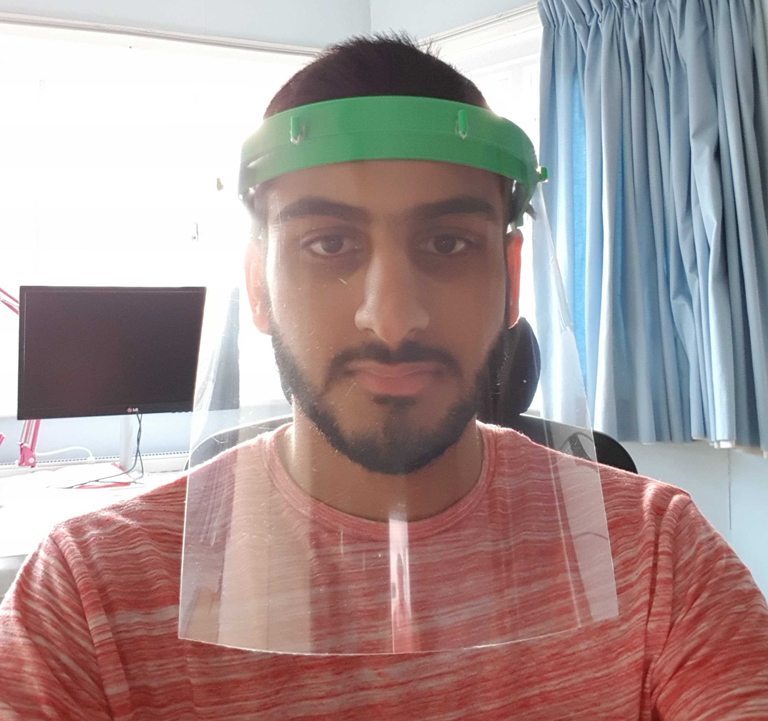
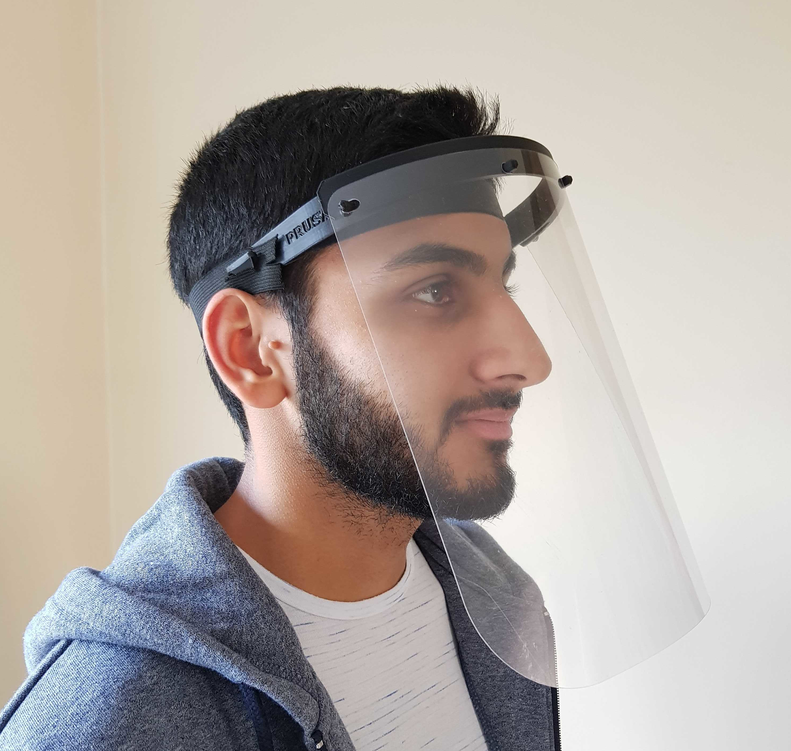
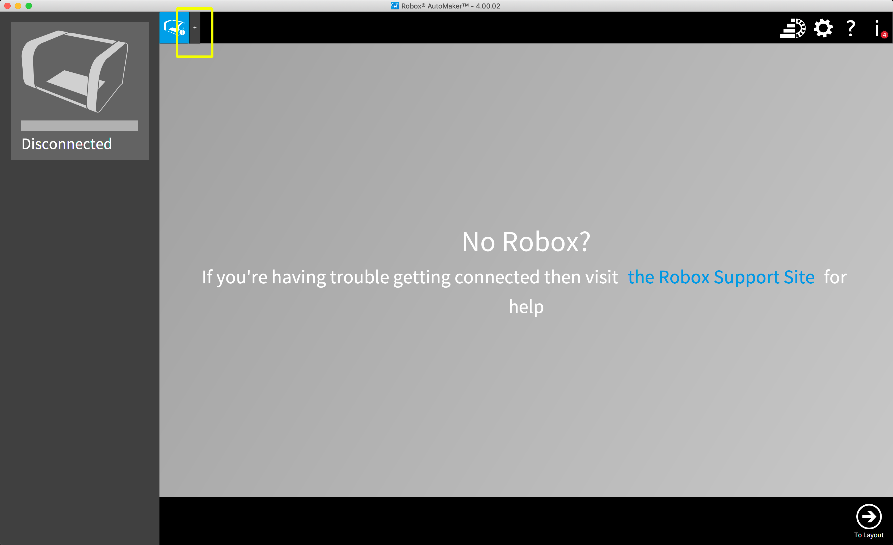
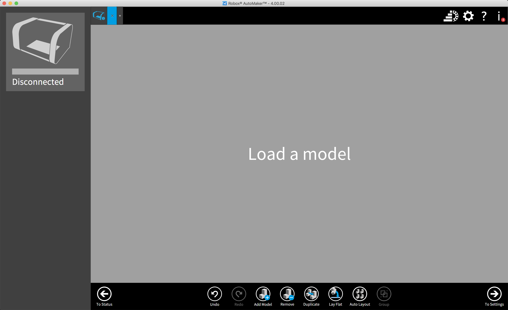
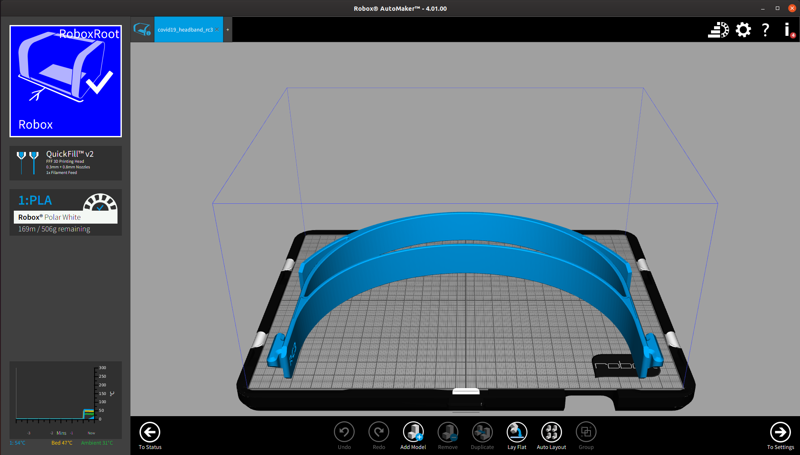
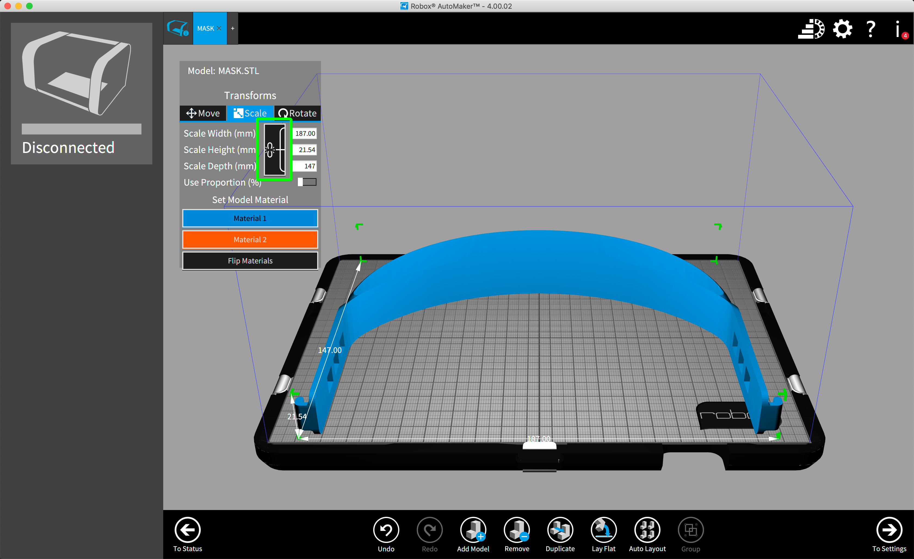
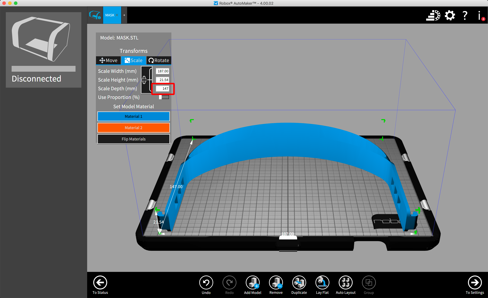
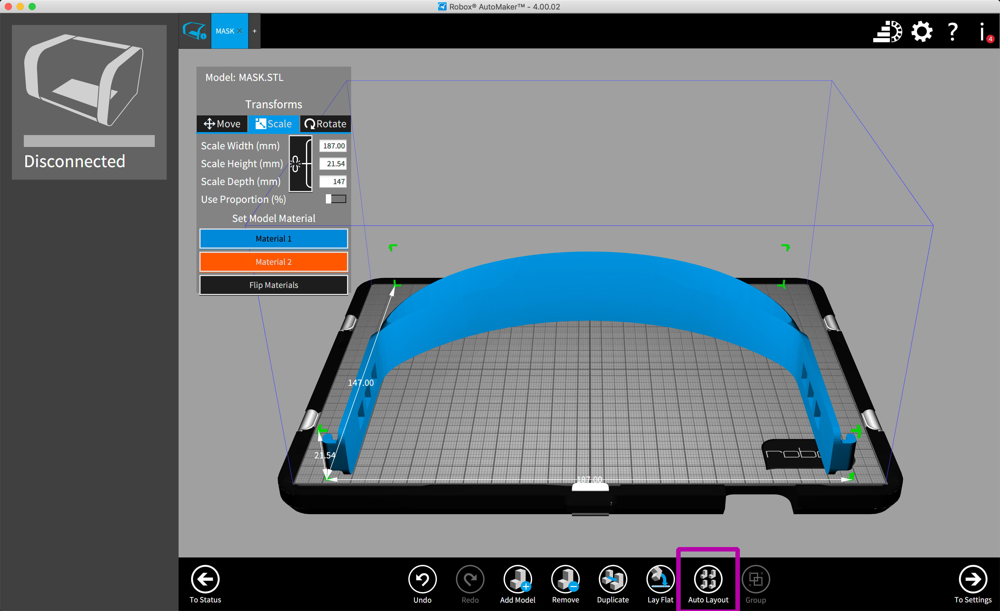
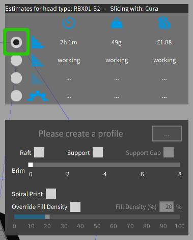

# Visors

NOTE: See [models](models.md) for which files to print. Do not use `visor.stl`.

## What is this document?

This document is a list of materials and instructions for constructing a face visor to help prevent contraction of infectious diseases, as well as contacts for coordinating the distribution of the visors.

Below are images of the finalised piece.

## Note for Medical Professionals

If you are an NHS worker, and you would like to add your details as a point of contact to receive these visors, please see the contact section at the end of this document and reach out to either Dhiresh Nathwana or Sean M. Tracey in any of the channels listed.

## Required tools + materials for constructing the visor.

- A 3D printer with a print space of at least 187mm by 167.5mm by 21.5mm
    - A printer with a smaller print area of 187mm by 147mm by 21.5mm can also be used with adjustements. Instructions below

- At least 10 meters of either ABS or PLA print filament
    - Other materials may service the print well too, but these are the only materials that have been tested at the time of writing these instructions

-If you wish to construct the face shield as well as the 3D print, you will need the following:
    - An A4-sized transparent acetate sheet of at least 300 micron thickness
    - 1 Rubber Band
    - If you wish to acquire acetate, we believe this should do the trick https://www.amazon.co.uk/gp/product/B006VYHPIY/ref=ppx_yo_dt_b_asin_title_o00_s00.

- 1 sandwich bag for packaging on completion.

## Standard print files to use

To standardise our printing processes and to ensure we’re not all printing different types of the same file.

### Visor 3D printing files

We should ALL printing the Prusa rc3: https://www.prusaprinters.org/prints/25857/filesFile name: covid19_headband_rc3.stl

If you would like to stack the prints please only use these: https://www.prusaprinters.org/prints/27267-prusa-protective-face-shield-rc31-stack-versions/filesFile name: covid19_headband_double_rc31.stl or covid19_headband_quadro_rc31.stl
Other files from the Prusa website may be used but please run it by Dhiresh before printing.

### Acetate sheets

If you don’t have any acetate please leave this to Anup, who has a rotary machine cutting all the sheets for us. All parts should be sent to Dhiresh for assembly.

If you do have acetate, the dimensions for the sheet should be 275*250mm. The longer side going across the headband.  

### Elastic

All elastic should be double knotted on one side of the headband with a length of 370mm.

## How to print

Neil Sewell of Solid Print3D has [written instructions](https://www.solidprint3d.co.uk/a-guide-to-printing-face-shields-battling-covid19-one-3d-print-at-a-time/) for printing the visor with the popular Ultimaker range of 3D printers

For those with the smaller CEL Robox 3D printers (used by Sean M. Tracey, Andy Stanford-Clark and others in the maker community) these instructions will walk you through how to adjust the parameters of the VISOR.stl (included in this repo) file with the CEL AutoMaker software.

### Step 1. Loading the STL

First download the STL file listed above to your computer, then open up the AutoMaker software.

Along the top of the application, there is a toolbar of tabs, to the right of any open tabs, click the + icon (highlighted in yellow) to begin the process of loading your STL file.

This will open a new tab with that says "Load a model" in the center of the view. Find the VISOR.stl file that you downloaded and drag and drop it into the center of the window.

If the model is too large for your printer, AutoMaker may ask you if you want to resize the STL before loading. Select the "No" option and load the model as is. (Not all systems will ask if you want to resize before loading the model. Don't worry if it doesn't just continue on below).

### Step 2. Resizing the model (this is probably not necessary for most printers)

If your printer is too small to print the full sized model, a 3D rendering of it will appear in the center of the screen, it will be highlighted red. You will need to resize the print, which we shall walk you through now. If you have a larger CEL printer, the rendering will appear blue and will not need resizing. Continue on to step 3.

To resize the model, first click on it in the AutoMaker app. A bounding box will appear around the model with the dimensions of the print, as well as a dialog giving you the option to move, scale, and rotate the model.

Click on the scale tab, and then click on the chain icon (highlighed above in green) so that the model is not scaled in all 3 dimensions.

Next, select the text box along side (Scale Depth (mm) ) (highlighted above in red) and change the value to 147mm and hit your return key. The model will resize on screen. This is the maximum size that your printer will be able to accomadate for the depth of the model, and the test prints conducted by Andy Stanford-Clark and Sean M. Tracey have come out perfectly servicable.

Your model may still appear red, this is because despite resizing our model, the bounds of the model are still outside of the print area of our printers. If you click the "Auto Layout" button at the bottom of the AutoMaker software (highlighted above purple), the model will be repositioned within the print area of your printer, and should turn blue.

### Step 3. Configuring the print.

Once your model has been loaded and positioned by the AutoMaker software, we're now able to configure the print density of our print.

Click the "To Settings" button at the bottom right corner (highlighted in orange) of the AutoMaker software to go through to the final configuration steps of our print.

We don't need a fine resolution print for the visor, so we'll use the preset options for the coarsest print. This will take ~2 hours to print one visor.

Select the radio button next (highlighted in green) to select the coarsest print.

(While we initially advised that you should enable the "Support" and "Support Gap" options, subsequent experimentation has shown it is not neccessary for a succesful print. You do not need to enable these options.)

### Step 4. The print.

We're now ready to start printing the visor. If you have spray adhesive, apply it to the print bed now, this will help prevent warping as the visors are printed. If you don't have the adhesive, keep an eye on the print to make sure that nothing goes awry during the fabrication process.

Click the "Make" button in the bottom right corner to begin the print. The model will be uploaded to your printer and the print will begin.

Once the print has completed, use a sharp knife to remove the scaffold at the side of the model, and any frizzy bits that may still be attached to the print. These should be easy to remove with just a little bit of pressue. If you didn't print with supports, you won't need to do this.

## Constructing the acetate face visor (optional)

If you have suitable acetate, you can also construct the protective plastic part of the visor (if you do not proceed to the "Where to send" instructions).

Place the sheet of acetate along the length of the 3d printed visor and make a mark with a where the hooks are along the print. Then, use a hole punch to make the holes through which the hooks will pass.

## How to package

Once the print is completed, you'll need to remove it from the print bed. Please, wash your hands with soap and use gloves if possible before you handle the print. Next, package it in a sealable sandwich bag as pictured below. This will help prevent contamination during transport.

Please also write the date that the print was packaged on. This is very important, the NHS will not use visors more than 5 days after they've been printed.

If you've also constructed the acetate protector, do not send the visor assembled. Instead, package the prepare acetate along with the 3d printed visor. They will be constructed on site.

If possible, please also include a rubber band to affix the visor to the wearers head.

## Where to send

### With Acetate

If you have printed the visor, and also have the acetate sheet to package, there is a Google Spreadsheet with the details of medical professionals who have reached out to ask for help. You can find that here and coordinate directly with those professionals. https://docs.google.com/spreadsheets/d/1o92tKDcumzmwRb1I07RO9nyIu-nmpfZ0STJr0_yxv-g/edit#gid=0

### Without Acetate.

If you've only printed the holder, but do not have acetate, you can forward your prints to us where we'll construct them and forward them on. Please reach out on the email address or Twitter account below for mailing details.

## Contact Details

Makers for the NHS
 - Email: makers4thenhs@gmail.com
 - Twitter: https://twitter.com/makers4thenhs
