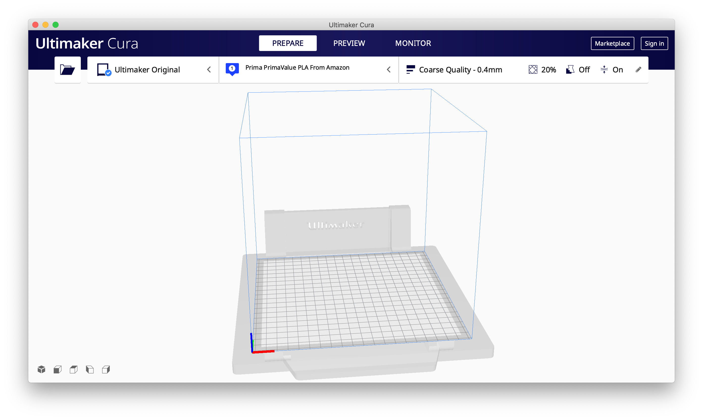
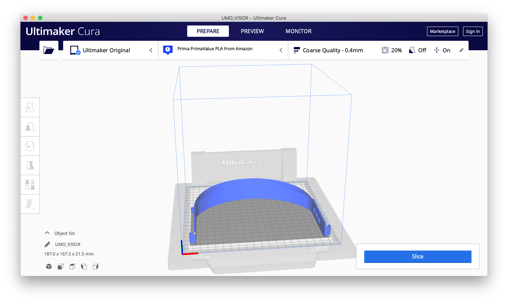
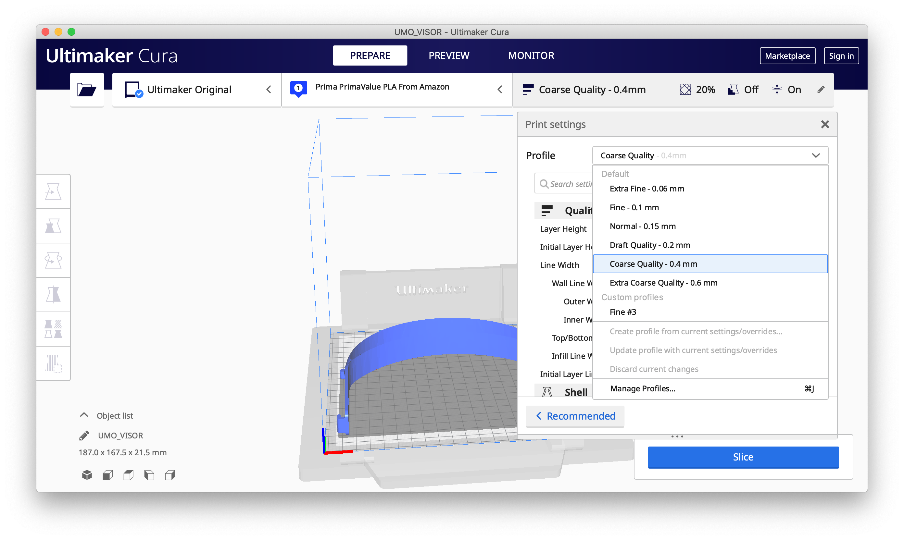

# Instructions for Printing with Cura

If you're using the (very excellent) [Cura](https://ultimaker.com/software/ultimaker-cura)
software to slice and print, then these instructions should help you print the PPE Visor.
Please also read the other instructions about printing too though - there's lots of
information in there about safe handling (and safe printing environments), packaging etc.
Since we're trying to prevent the spread of Coronavirus, please make sure you take appropriate
precautions to avoid spreading it on the visor!

## Prepare for Printing

When you open Cura, it should look something like this:

I'm assuming you've used Cura before and it's set up for your printer. Next, load the visor
model (File -> Open File -> VISOR.STL). It should look like this:

Next, select the printing profile (top right). The default settings for "draft quality" are
ideal for printing the visor (quality isn't that important):

The important settings are:
 * 0.4mm layers
 * 20% infill
 * 60mm/s print speed
 * brim type "bed adhesion"

Additionally ensure you've selected the correct material to print with (PLA is good, ABS
is fine too). If there are any other settings you need to use that are specific to your
printer then set them now.

The print is big and wide and quite thin - and so very prone to warping. If you have a
heated bed you'll need to use it, otherwise you may need adhesive on the blue painters tape.
Printing with a brim will also avoid warping, but you'll need to remove the brim after
printing (please observe handling precautions!). 

Lastly, prepare for printing - press "Slice" (bottom right). You should see something
like this:

## Printing

In my case I print with Octoprint, but you should use whatever method to print you
normally use.

Each print should take approximately 1 hour 30 minutes, and uses about 4 metres of
3mm filament.
